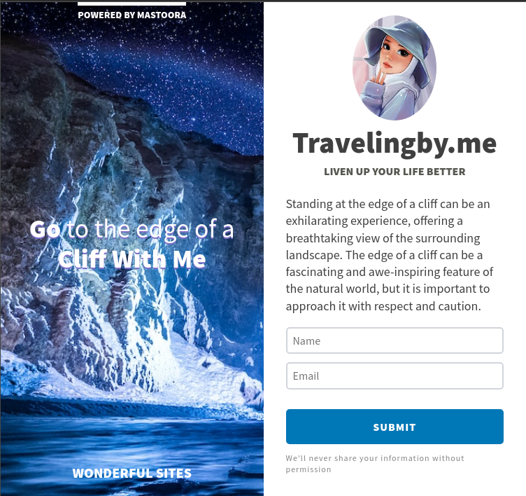

# My Wonderful Traveling Site

On this website, I made a wonderful Traveling site. The edge of a cliff refers to the point where the land drops off sharply, often into a steep decline or a body of water below. The edge of a cliff can be a scenic viewpoint or a dangerous hazard, depending on the context and location. Wooh I am so much excited! :)

## The Site Screenshots

## Tablet 

## Desktop 💻
