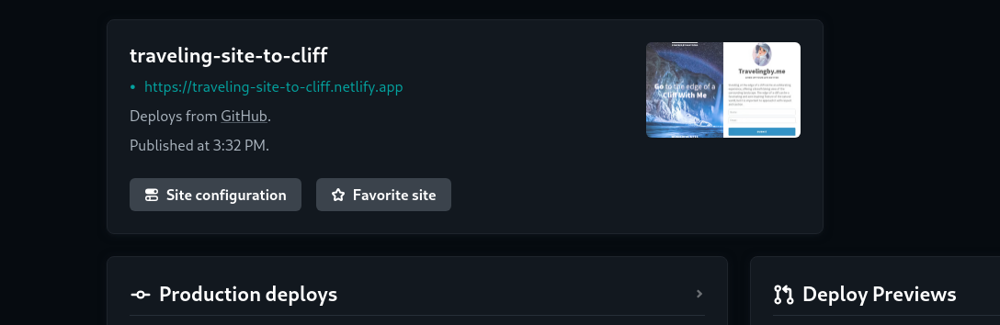

# My Wonderful Traveling Site

[Woderful Site](https://traveling-site-to-cliff.netlify.app/)

On this website, I made a wonderful Traveling site. The edge of a cliff refers to the point where the land drops off sharply, often into a steep decline or a body of water below. The edge of a cliff can be a scenic viewpoint or a dangerous hazard, depending on the context and location. Wooh I am so much excited! :)

## The Site Screenshots

## Mobile 📱


## Tablet 


## Desktop 💻


-----

## For cloning the project 🪛

```
# Clone this repository
$ gh repo clone MastooraTurkmen/Wonderful-Site

# Go inside the repository
$ cd wonderful-site

```


----


## Deployment 📪

+ **How to deploy our project to netlify site?**
   + **I use [Netlify App](https://app.netlify.com/) for deploying my projects.**
   + **Go to Netlify site and select Add a new site.**
   + **From here select _Deploy with Github_**
   + **Then write your project name and select it**
   + **After selecting here you can see that the project _Wonderful-Site_ and then select the _Deploy Wonderful-Site_ Button**
   + **Now your project is Live**
   
